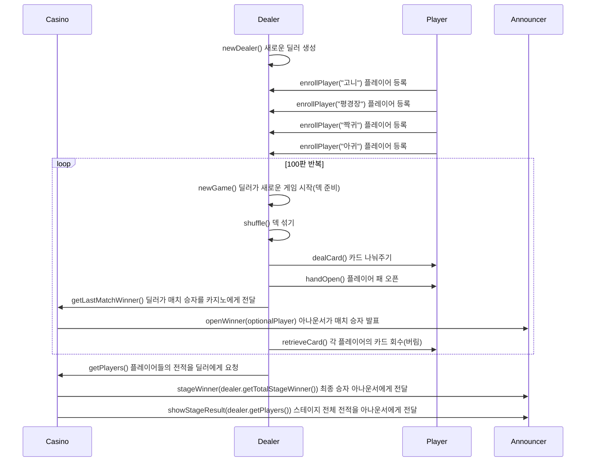

```mermaid
sequenceDiagram
    participant Casino
    participant Dealer
    participant Player
    participant Announcer

    Dealer->>Dealer: newDealer() 새로운 딜러 생성
    Player->>Dealer: enrollPlayer("고니") 플레이어 등록
    Player->>Dealer: enrollPlayer("평경장") 플레이어 등록
    Player->>Dealer: enrollPlayer("짝귀") 플레이어 등록
    Player->>Dealer: enrollPlayer("아귀") 플레이어 등록

    loop 100판 반복
        Dealer->>Dealer: newGame() 딜러가 새로운 게임 시작(덱 준비)
        Dealer->>Dealer: shuffle() 덱 섞기
        Dealer->>Player: dealCard() 카드 나눠주기
        Dealer->>Player: handOpen() 플레이어 패 오픈

        Dealer->>Casino: getLastMatchWinner() 딜러가 매치 승자를 카지노에게 전달
        Casino->>Announcer: openWinner(optionalPlayer) 아나운서가 매치 승자 발표

        Dealer->>Player: retrieveCard() 각 플레이어의 카드 회수(버림)
    end

    Dealer->>Casino: getPlayers() 플레이어들의 전적을 딜러에게 요청
    Casino->>Announcer: stageWinner(dealer.getTotalStageWinner()) 최종 승자 아나운서에게 전달
    Casino->>Announcer: showStageResult(dealer.getPlayers()) 스테이지 전체 전적을 아나운서에게 전달
```